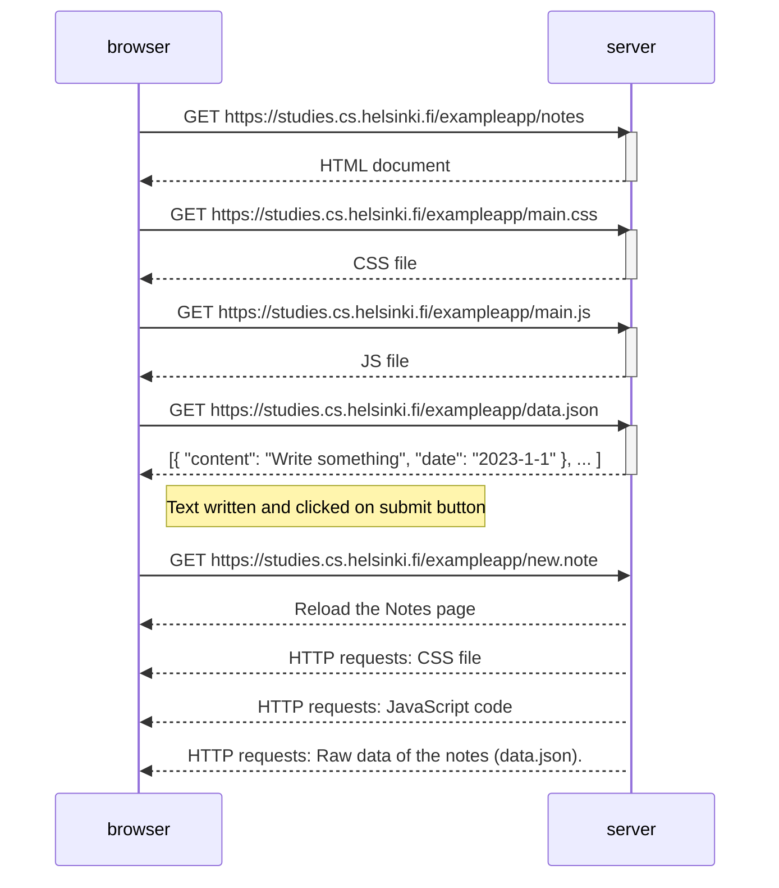

```mermaid
sequenceDiagram
    participant browser
    participant server

    browser->>server: GET https://studies.cs.helsinki.fi/exampleapp/notes
    activate server
    server-->>browser: HTML document
    deactivate server

    browser->>server: GET https://studies.cs.helsinki.fi/exampleapp/main.css
    activate server
    server-->>browser: CSS file
    deactivate server

    browser->>server: GET https://studies.cs.helsinki.fi/exampleapp/main.js
    activate server
    server-->>browser: JS file
    deactivate server

    browser->>server: GET https://studies.cs.helsinki.fi/exampleapp/data.json
    activate server
    server-->>browser: [{ "content": "Write something", "date": "2023-1-1" }, ... ]
    deactivate server

    Note right of browser : Text written and clicked on submit button

    browser->>server: GET https://studies.cs.helsinki.fi/exampleapp/new.note
    activate server
    server-->>browser: Reload the Notes page
    server-->>browser: HTTP requests: CSS file
    server-->>browser: HTTP requests: JavaScript code
    server-->>browser: HTTP requests: Raw data of the notes (data.json).
```
